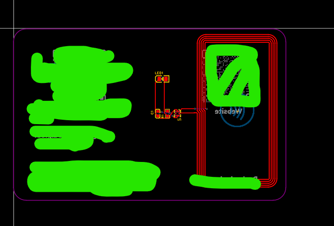

**PCBBusinessCard**
PCB Card for business card and Access card with NFC Antenna

## Overview
Features:
- Be scanned by phone
- Beautiful

## Hardware
See the BOM in [bom.csv](BOM.csv) or at the end of file

## Recap:
**PCB:**
[Gerber](Gerber_PCB1_2026-08-10.zip)

## BOM
| Catégorie    | Article         | Quantité | Prix unitaire (€) | Prix total (€) | Notes                                                                            | URL                                                                                                                                        |
| ------------ | --------------- | -------: | ----------------: | -------------: | -------------------------------------------------------------------------------- | ------------------------------------------------------------------------------------------------------------------------------------------ |
| LED          | KP-2012SYCK     |        1 |            0,86 € |         0,86 € | LED jaune CMS 0805 (2012), 20 mA, 2 V, 590 nm, 150 mcd, angle 120°               | [Farnell – KP-2012SYCK](https://fr.farnell.com/kingbright/kp-2012syck/led-cms-alingap-jaune/dp/1318246?utm_source=chatgpt.com)             |
| Résistance   | RC0603FR-0747RL |        1 |            0,10 € |         0,10 € | 47 Ω, ±1 %, 100 mW, CMS 0603 (1608), couche épaisse                              | [Farnell – RC0603FR-0747RL](https://fr.farnell.com/yageo/rc0603fr-0747rl/res-couche-epaisse-47r-1-0-1w/dp/9238328?utm_source=chatgpt.com)  |
| Condensateur | CL10B224KA8NNNC |        1 |            0,22 € |         0,22 € | 220 nF, 25 V, ±10 %, X7R, CMS 0603 (1608)                                        | [Farnell – CL10B224KA8NNNC](https://fr.farnell.com/samsung-electro-mechanics/cl10b224ka8nnnc/condensateur-0-22uf-25v-mlcc-0603/dp/3013426) |
| NFC / RFID   | NT3H2111W0FHKH  |        1 |            1,07 € |         1,07 € | NTAG I²C Plus, NFC 13,56 MHz, I²C, alimentation 1,67–3,6 V, XQFN-8, mémoire 1 kB | [Farnell – NT3H2111W0FHKH](https://fr.farnell.com/nxp/nt3h2111w0fhkh/rfid-lect-ecrit-13-56mhz-xqfn/dp/2663148)                             |
|              | **Total**       |    **4** |                   |     **2,25 €** |                                                                                  |                                                                                                                                            |
